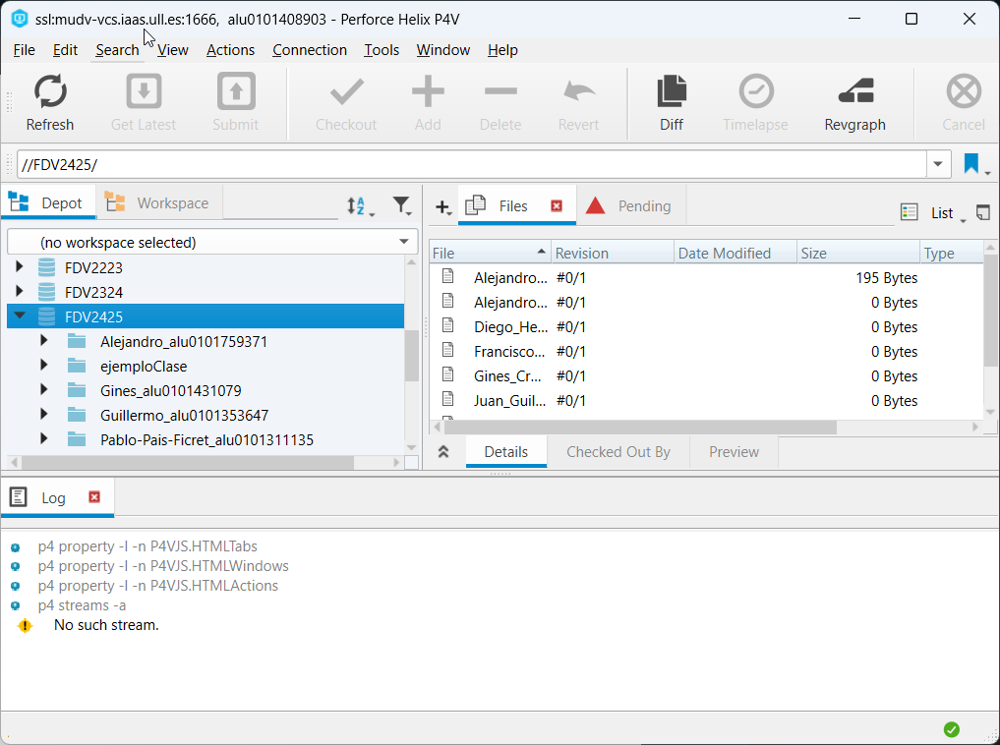
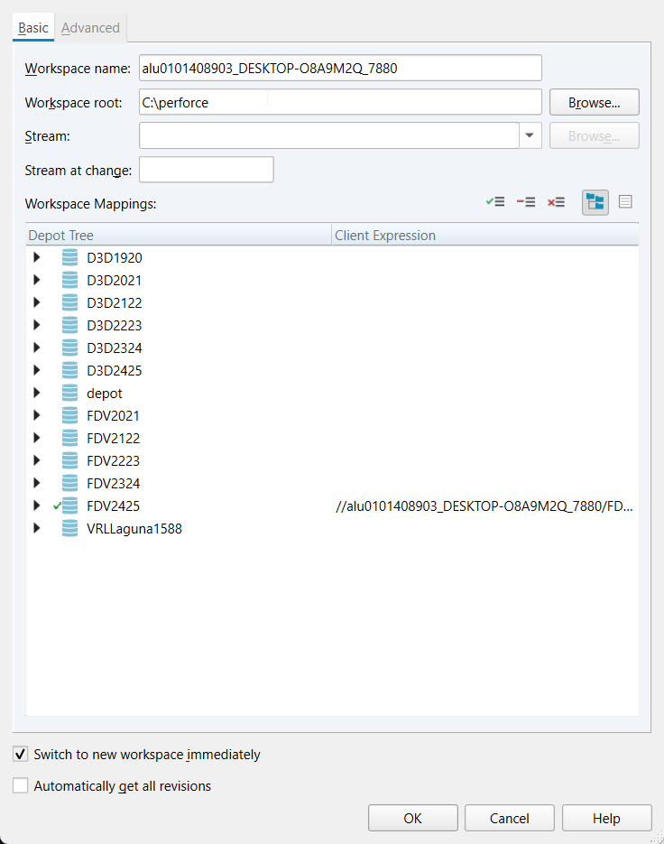
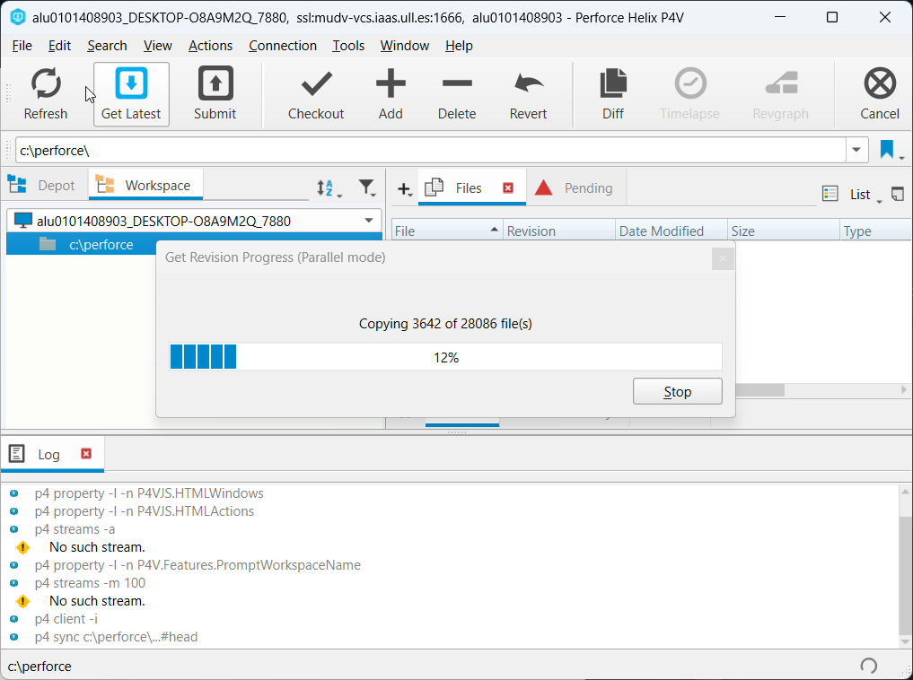
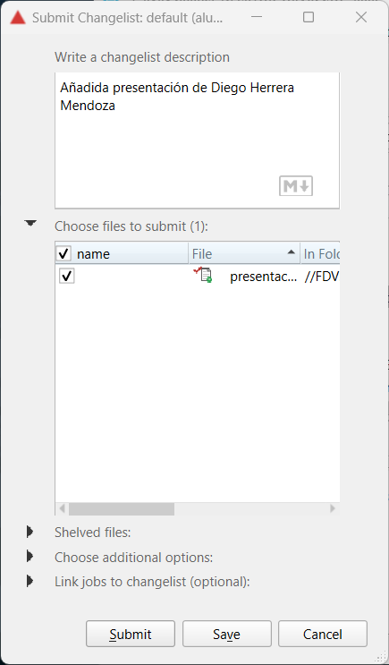
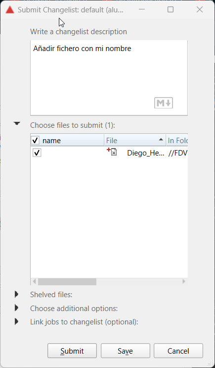
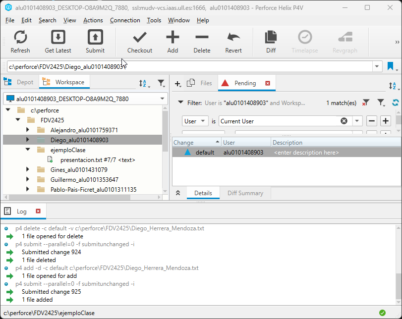
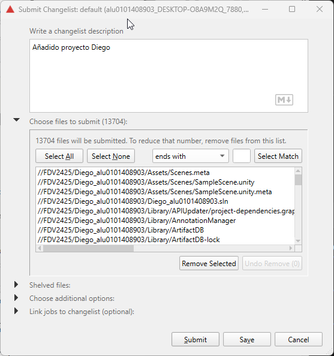

# Fundamentos del desarrollo de videojuegos
## Práctica 1.3
### Diego Herrera Mendoza
Unity Perforce
1. Crear una conexión al depósito FDV2425 en la ULL

Nos conectamos al Perforce de la ULL y buscamos el depot FDV2425.

Creamos un workspace y lo vinculamos al depot, asegurándonos de solo marcar FDV2425.

2. Clonar el repositorio

Clonamos el contenido del depot a nuestro workspace.

3. Modificar el fichero presentacion.txt, agregando una frase que indique tu nombre y resuma tu experiencia en el programación de videojuegos 2D y 3D.

Hacemos checkout al fichero ejemploClase/presentacion.txt para modificarlo y añadimos la presentación

4. Crear un fichero nuevo, tu_nombre.txt y añádelo al proyecto.

Creamos el fichero `Diego_Herrera_Mendoza.txt` y lo añadimos al depot.

5. Crear un proyecto Unity 3D básico y agregarlo al depot de la asignatura. Tu nombre debe ser prefijo.

Añadimos el proyecto al depot con nombre "Diego_alu0101408903".

Añadimos los cambios y los subimos al depot.

